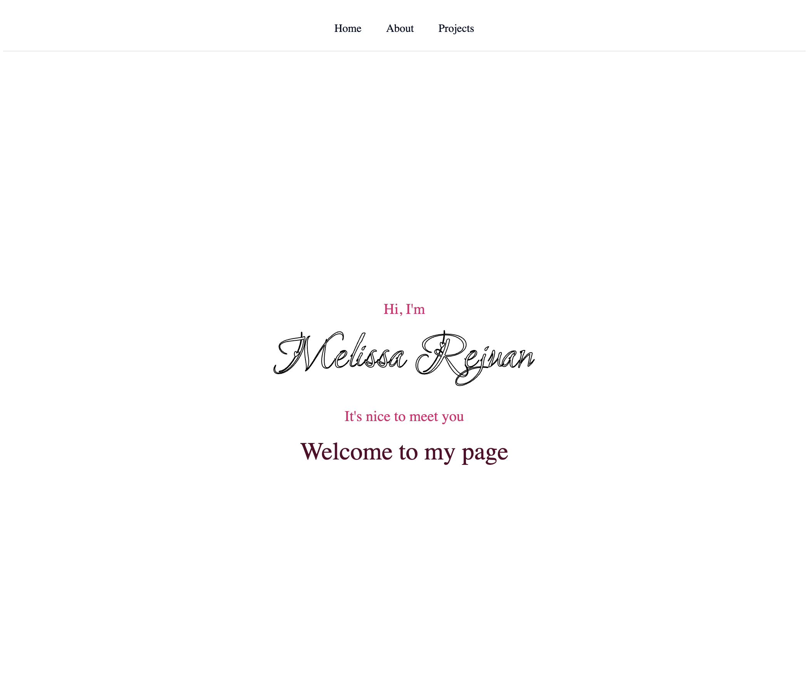

# Personal Homepage

A multi-page personal portfolio website built with vanilla HTML5, CSS3, and ES6+ modules.

🔗 **Live site:** [mrejuan3.github.io/Personal-Homepage](https://mrejuan3.github.io/Personal-Homepage/)

---

## Author

**Melissa Rejuan**  
Northeastern University — MS Data Science  
GitHub: [@mrejuan3](https://github.com/mrejuan3)

---

## Class

<!-- Replace the URL below with the actual course link -->
[Web Development – Course Page](https://johnguerra.co/classes/webDevelopment_online_summer_2026/)

---

## Project Objective

Build a fully static, three-page personal homepage that demonstrates core front-end skills:

| Requirement | Implementation |
|---|---|
| HTML5 semantic markup | `<nav>`, `<main>`, `<section>`, `<article>`, `<header>`, `<footer>`, `<ul>`/`<li>` throughout |
| CSS3 layout & animation | Flexbox centering, `position: sticky` nav, `stroke-dasharray` signature draw, `IntersectionObserver` card entrance |
| ES6+ modules | `type="module"` on every `<script>`; `import`/`export` between `main.js` and `projects.js` |
| Bootstrap 5 grid | Responsive 3 → 2 → 1 column project grid via `col-lg-4 col-md-6` |
| Accessibility | `alt` text on all images, `aria-label` on icon-only links, `aria-hidden` on decorative SVGs |

### Pages

- **Home (`index.html`)** — animated SVG signature with staggered draw effect, greeting, and footer tagline
- **About (`about.html`)** — circular headshot, biographical paragraph
- **Projects (`projects.html`)** — six project cards, each with a unique hand-drawn SVG illustration, a skill tag, and a GitHub link

---

## Screenshot

<!-- After taking a screenshot, save it to images/screenshot.png and remove this comment -->


---

## Project Structure

```
Personal-Homepage/
├── index.html          # Home page
├── about.html          # About page
├── projects.html       # Projects page
├── css/
│   ├── index.css       # Home page styles
│   ├── about.css       # About page styles
│   └── projects.css    # Projects page styles (includes Bootstrap overrides)
├── js/
│   ├── main.js         # Entry point — imports and calls page initialisers
│   └── projects.js     # IntersectionObserver card entrance animation
├── images/
│   ├── photo.jpeg      # Headshot used on About page
│   └── favicon_io/     # Favicon set (all sizes + site.webmanifest)
├── package.json        # "type": "module" + ESLint/Prettier dev deps
└── eslint.config.mjs   # ESLint flat config
```

---

## Instructions to Build

### View the live site

The easiest way to view the project is through the deployed GitHub Pages URL — no setup required:

👉 **[mrejuan3.github.io/Personal-Homepage](https://mrejuan3.github.io/Personal-Homepage/)**

---

### Run locally (for development)

This is a **fully static site** — there is no compile or bundle step. You only need Node.js installed if you want to run the linter.

#### 1 — Clone the repository

```bash
git clone https://github.com/mrejuan3/Personal-Homepage.git
cd Personal-Homepage
```

#### 2 — Install dev dependencies (optional — linting only)

```bash
npm install
```

This installs ESLint and Prettier. The website itself has no npm runtime dependencies.

#### 3 — Start a local server

**Option A — VS Code Live Server (recommended)**  
Install the [Live Server](https://marketplace.visualstudio.com/items?itemName=ritwickdey.LiveServer) extension, right-click `index.html` in the Explorer panel, and choose **Open with Live Server**.  
Live Server auto-reloads the page on every save.

**Option B — Python one-liner**  
```bash
python3 -m http.server 8080
# then open http://localhost:8080 in your browser
```

> **Note:** A local server is required because `type="module"` scripts are blocked by browsers on raw `file://` URLs. The page will still display if opened directly in Finder, but the card entrance animation on the Projects page will not run.

#### 4 — Lint (optional)

```bash
npx eslint js/
```

---

## Technologies Used

- HTML5
- CSS3 (custom properties, Flexbox, keyframe animations)
- JavaScript ES6+ (modules, `IntersectionObserver`, `classList`)
- [Bootstrap 5.3](https://getbootstrap.com/) — grid system on Projects page
- [Google Fonts](https://fonts.google.com/) — Dancing Script (titles), Inter (body)
- ESLint + Prettier — code quality

---

## AI Use

**AI assistant:** Claude Code — Opus 4.7 (Anthropic)

| # | Prompt |
|---|---|
| 1 | Can you give examples of creative additions to a static personal portfolio website? It can be implemented using ES6+ or HTML+CSS alone. |
| 2 | Do not edit the code. How do I use classes to identify elements? |
| 3 | Play the role of a frontend engineer. Please create the projects page. Do not use jQuery, all of the JS code must be in ES6 modules. Use HTML5, CSS3, and ES6+ only. I want each project to be organized using a Bootstrap 5+ grid. There are 6 projects: Exoplanet Exploration, Global Longevity Analysis, NLP Analysis of Tweets by Global Leaders, Breast Cancer Risk Modelling & Clinical Decision Support, Business Scaling & Production, and TA Resource Allocation. Each project must be labelled by technical skill. The title should be "My Projects" in a script font. Each project box should have a design related to the project. |
| 4 | Can you have the projects page match the style the other pages |
| 5 | Can you create a clear and descriptive README including: Author, Class Link, Project Objective, Screenshot, Instructions to build |
| 6 | Add an AI Use section to the README. Only add the AI & model used and AI Prompts |

---

## License

[MIT](LICENSE)
